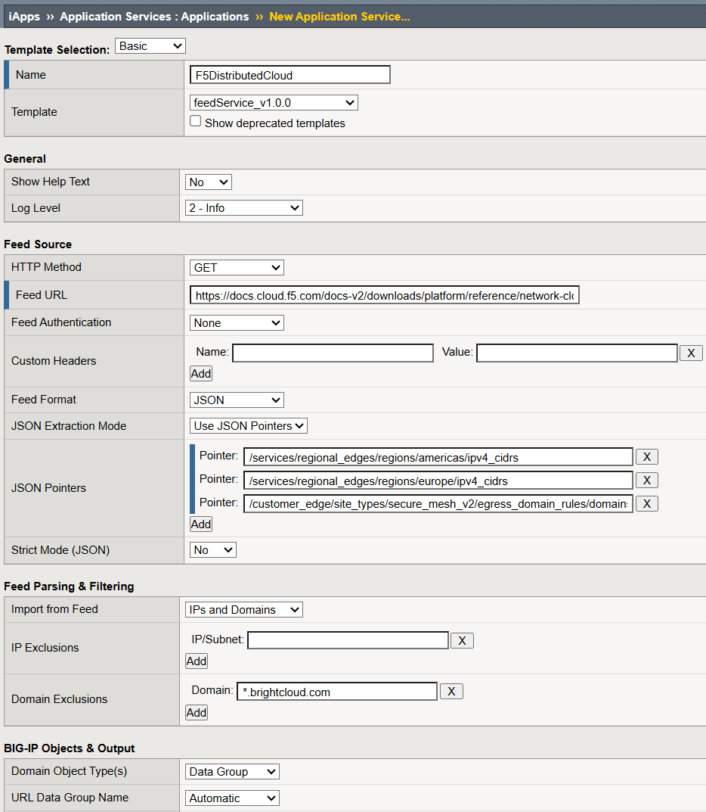

# feedService

> **Version:** 1.0.0 
> **Last Modified:** June 30, 2026  
> **Author:** Regan Anderson, F5 Inc.

## Overview

feedService is an iApp- and Python-based automation solution that enables F5 BIG-IP devices to automatically download and process remote threat intelligence feeds, URL blocklists, and IP address lists. The solution intelligently classifies feed data and imports it into BIG-IP data constructs (Data Groups and Custom URL Categories) for use in Local Traffic Policies, security policies, URL filtering, iRules, and more.

## Features

- **Multi-Format Feed Support**: Parse feeds in multiple formats
  - Line-based (one entry per line)
  - CSV (with configurable column selection)
  - Delimited (custom separator)
  - JSON (RFC 6901 JSON pointers or full-document string extraction)
  - Regular expression (regex)

- **Intelligent Data Classification**: Automatically classify and normalise feed entries as:
  - IPv4 addresses and subnets (enforces proper CIDR notation)
  - IPv6 addresses and subnets (with compression normalisation)
  - Domain names (with wildcard support)

- **Flexible Authentication**: Connect to remote feeds using:
  - No authentication
  - Basic HTTP authentication
  - Bearer token authentication
  - Custom headers

- **Proxy Support**: Route requests through corporate proxies

- **Comprehensive Validation**: 
  - RFC-compliant domain validation (DNS labels, TLD validation, etc.)
  - IP address/subnet validation with strict network address enforcement
  - Automatic comment removal
  - Duplicate detection and removal
  - Invalid entry filtering and logging

- **BIG-IP Data Integration**: 
  - Data Groups (for IPs & domains)
  - Custom URL Categories (domains)

- **User-Defined Exclusions & Inclusions**: 
  - Automatically remove user-defined entries from a feed or add user-defined entries to a feed
  - IP address exclusions (supports subnet pattern matching, e.g., `10.0.0.0/8`)
  - Domain exclusions (supports wildcard pattern matching, e.g., `*.example.com`)
  - IP address inclusions (processed last for priority)
  - Domain inclusions (processed last for priority)

- **Change Detection**: 
  - Hash-based change detection to skip processing when feed data has not changed
  - Delta detection with configurable thresholds to catch potential issues with feed
  - Force-update capability for on-demand/unscheduled updates

- **Offline Object Refresh**:
  - Refresh URL/IP data groups and URL category objects from cached feed data without fetching from a remote source
  - Useful when application-service include/exclude/object settings change and you want to rebuild objects without pulling a new feed

- **Last-Run State Persistence**:
  - Automatically persists last-run state in BIG-IP internal data group (`fS_<AppSvcName>_lastrun`)
  - Tracks last object-change time, normalized feed hash, result status, detail message, processed item count, and rejected entries
  - Enables hash-based change detection across script executions

- **Comprehensive Logging**:
  - File-based logging with automatic rotation
  - Event logging to BIG-IP's LTM log (/var/log/ltm)
  - Multiple log levels (debug, info, warning, error)
  - Detailed processing statistics and summaries

- **Scheduling**: Supports scheduled execution via BIG-IP's iCall task scheduler

## Requirements

### System Requirements & Assumptions

- **BIG-IP**: Version 17.5 or newer
- **Network**: Outbound HTTP(S) connectivity to feed endpoints
- **Proxy**: HTTP(S) proxy support
- **Partitions**: This iApp can only be deployed in the Common partition
- **HA Sync**: This iApp only supports syncing configuration via sync-failover device groups
- **Appliance Mode**: Not supported

### Feed Endpoint Requirements

- Valid HTTP(S) endpoint (self-signed certificates supported with a custom CA certificate file)
- Feed data in supported format (newline, CSV, delimited, JSON, regex)
- Feed should be UTF-8 encoded; other encodings may decode but can cause normalisation surprises
- The feed endpoint must return 200 OK for successful fetches; any other status is treated as a failure and retried.

## High-Availability (HA) Considerations

feedService works on standalone BIG-IPs as well as on two BIG-IPs in an active/standby HA pair.

Before implementing feedService on an HA pair, it is important to understand the following:
- feedService should be installed on the Active BIG-IP and subsequently synced to the Standby BIG-IP via ConfigSync.
- feedService only runs on the active BIG-IP in an HA pair.
- feedService configuration, outputs (Data Groups and/or Custom URL Categories), and last-run data are synchronised between BIG-IPs using the built-in ConfigSync mechanism.
- feedService logs are not synchronised.
- All Sync Types are supported (i.e. Manual Full/Incremental & Automatic Full/Incremental).

Each time feedService updates the configuration on the Active BIG-IP, the configuration sync state of the Device Group will move to "Changes Pending" (if it was not already in this state). With Automatic Sync, this is largely unnoticed by the BIG-IP administrator, as the updated configuration will automatically sync and the Device Group will return to "In Sync." For BIG-IPs in a Manual Sync Device Group, the sync status will remain in the "Changes Pending" state until the BIG-IP administrator manually synchronises the configuration. This will lead to a disparate configuration state that may cause issues upon failover, and it may also confuse BIG-IP administrators who are unfamiliar with feedService's automated updates.

To help mitigate these potential issues, two sync/failover-related features are available - **Sync on Update** and **Run on Failover**. Please review these settings and their side effects below.

- **ConfigSync Scope** - If **Sync on Update** is enabled, the configuration on the Active BIG-IP will be synchronised to the Standby BIG-IP when the contents of the Data Group(s) and/or Custom URL Category change. This automated trigger will synchronise *all* pending changes on the Active device, not only feedService-managed objects.

- **Failover Behaviour** - If **Run on Failover** is enabled, feedService will execute on the new Active device upon failover. This automated trigger will potentially result in a configuration state conflict (i.e. a red Changes Pending). Validate this behaviour against your change-control and outage policies.

## Security Considerations

- **Secrets Handling** - Basic authentication passwords and bearer tokens are stored in plaintext in the application service iFile. Limit access to BIG-IP configuration objects and filesystem locations that can expose those values.
- **Certificate Validation** - Use trusted CA bundles and avoid bypassing TLS verification. Keep custom CA files current and remove deprecated trust anchors.
- **Feed Trust Boundary** - Treat external feed content as untrusted input. Prefer reputable feed providers and monitor for unexpected format/content changes.
- **Log Data Sensitivity** - Logs can contain operational details (URLs, object names, and processing outcomes). Limit configured logging levels when possible and restrict who has access to the logs.
- **Network Egress Controls** - Limit outbound connectivity to approved feed endpoints and required proxy infrastructure only.
- **Change Management** - Validate new feeds and parser settings in non-production first, and keep rollback/backup procedures ready before enabling scheduled runs.

## Other Precautions

⚠️ **Custom URL Categories** - Loading large Custom URL Categories (more than ~1000 domains) can result in temporary interruptions to the control / management plane of the BIG-IP. While this does not impact traffic processing / the data plane, if the script is expected to handle large datasets it would be advisable to use Data Groups instead, or schedule the script to run when the control / management plane of the BIG-IP is least likely to be used (ex. after hours). This bottleneck can be somewhat mitigated on TMOS 21.0+ by [increasing the number of threads available to MCPD](https://techdocs.f5.com/en-us/bigip-21-0-0/big-ip-release-notes/big-ip-new-features.html#control-plane-scalability-mcpd-multithreading).

This is software. There will be bugs / incompatibilities. Please ensure that you have a robust backup strategy in place.

## Installation

**Import the iApp template** into your *active* BIG-IP:
   1. Navigate to **iApps > Templates > Templates** in the BIG-IP web UI
   2. Click **Import...**
   3. Click **Choose File** and select the **feedService** template from your local filesystem (ex. feedService_v1.0.0.tmpl)
   4. Click **Upload**

## Configuration

The feedService iApp can be deployed for as many feeds as you wish to import and monitor.

**To deploy an instance** of the iApp:
   1. Navigate to **iApps > Application Services > Applications** in the BIG-IP web UI
   2. Click **Create** and select the **feedService** template (ex. feedService_v1.0.0)
   3. Configure the required parameters (see Configuration Parameters)
   4. Click **Finished** to deploy

## Configuration Parameters

All feedService settings are managed via the Application Service interface. These settings are detailed in the sections below and follow the same flow as the feedService configuration screen.

---

### General

- **Show Help Text** - Toggles inline help text on the application service configuration screen.
- **Log Level** - Defines the logging level and verbosity for monitoring and troubleshooting.
  - **1 - Error** - Logs failures and critical run status.
  - **2 - Info** - Adds normal operational messages, summaries, warnings, and successful update/sync messages.
  - **3 - Debug** - Full debug trace, including per-entry processing, classification, request metadata, and hash/comparison details.

---

### Feed Source

- **HTTP Method** - Defines the HTTP method to use for fetching the feed. Select 'GET' for standard feed retrieval or 'POST' if the feed requires a POST request.
- **Feed URL** - Defines the URL for the HTTP request. This should be the full URL of the feed, including protocol/scheme (e.g. https://example.com/feed.txt).
- **Authentication** - Defines the authentication method used for the feed fetch request.
  - **None** - the feed does not require authentication.
  - **Basic** - to use a username and password.
  - **Bearer Token** - to use a token in the Authorization header.
- **Username** - Defines the username used for Basic authentication. *This option is only available if Basic authentication is selected.*
- **Password** - Defines the password used for Basic authentication. *This option is only available if Basic authentication is selected.*
- **Bearer Token** - Defines the bearer token used for Bearer Token authentication. *This option is only available if Bearer Token authentication is selected.*
- **Custom Headers** - Defines one or more custom HTTP headers to include in the HTTP request. This optional setting can be used to include any additional headers required by the feed provider. Only static values are supported.
  - **Name** - Custom header name.
  - **Value** - Custom header value.
- **Request Body** - Defines the request body to include in the HTTP request when using the POST method. *This is optional and can be left blank for feeds that do not require a request body.*
- **Feed Format** - Defines the expected format of the feed data.
  - **Line-separated** - the feed contains one feed item (i.e. URL or IP) per line.
  - **CSV** - the feed is in CSV (comma-separated) format. Fields wrapped in matching single or double quotes are automatically unwrapped.
  - **Delimited** - the feed items are separated by a custom delimiter.
  - **JSON** - extract feed items using JSON pointers (RFC 6901) or by scanning the entire document for string values.
  - **Regex** - use a custom regular expression to extract feed items from the feed data.
- **CSV Position (Column)** - Defines the zero-based position of the column containing feed items. For example, if the feed items are in the first column, enter '0'. If they are in the second column, enter '1', and so on. *This option is only available if the CSV feed format is selected.*
- **CSV Has Header Row** - When enabled, the first CSV row is treated as a header row and skipped during import. *This option is only available if the CSV feed format is selected.*
- **Delimiter** - Defines the delimiter separating the feed items. This is required when the feed uses a custom delimiter other than line breaks and commas. For example, if the feed items are separated by semicolons, enter ';' as the delimiter. Matching outer quotes around each extracted item are removed automatically. *This option is only available if the Delimited feed format is selected.*
- **JSON Extraction Mode** - Controls how JSON feed data is extracted.
  - **Use JSON Pointers** - Extract values only from configured RFC 6901 pointers.
  - **Extract Entire Document** - Recursively scan the full JSON document and extract all string values.
- **JSON Pointers** - Defines one or more JSON pointers used to extract values from a JSON feed payload. Data from all configured pointers is merged. Examples: `/indicators`, `/data/items`, `/results/0/value`. *This option is only available when JSON format is selected and JSON Extraction Mode is set to Use JSON Pointers.*
- **Strict JSON Pointer Validation** - When enabled, all configured JSON pointers must resolve and return one or more values or the run fails. When disabled, unresolved or empty pointers are logged and skipped. *This option is only available when JSON format is selected and JSON Extraction Mode is set to Use JSON Pointers.*
- **Regex Pattern** - Defines the regular expression used to match feed items. Only items matching this regex will be imported. *This option is only available if the Regex feed format is selected.*

⚠️ **Credentials stored in plaintext** - Basic passwords and bearer tokens are stored in plaintext within the application service iFile. Restrict access to BIG-IP filesystem and configuration objects accordingly.

---

### Feed Parsing & Filtering

- **Import from Feed** - Defines the type of feed data to import and process.
  - **Only IPs** - import and process only IP addresses.
  - **Only Domains** - import and process only domains.
  - **IPs and Domains** - import and process IP addresses and domains.

- **IP Exclusions** - Defines IP addresses/subnets to exclude/remove from the imported feed data. Matching items will not be imported into the Data Group. Supports subnet pattern matching (e.g., `10.0.0.0/8` excludes all IPs in that subnet).
- **Domain Exclusions** - Defines domains to exclude/remove from the imported feed data. These will not be imported into the URL Category / Data Group. Supports wildcard pattern matching (e.g., `*.example.com` excludes all subdomains of example.com).

---

### BIG-IP Objects & Output

- **Domain Object Type(s)** - Defines the type of BIG-IP object(s) to load the domains into.
  - **Both** - Domains will be imported into a Custom URL Category and Data Groups.
  - **Data Group** - Domains will only be imported into Data Groups.
  - **Custom URL Category** - Domains will only be imported into a Custom URL Category.

⚠️ **Custom URL Categories** - Loading large Custom URL Categories (more than ~1000 domains) can result in temporary interruptions to the control / management plane of the BIG-IP. While this does not impact traffic processing / the data plane, if the script is expected to handle large datasets it would be advisable to use Data Groups instead, or schedule the script to run when the control / management plane of the BIG-IP is least likely to be used (ex. after hours). This bottleneck can be somewhat mitigated on TMOS 21.0+ by [increasing the number of threads available to MCPD](https://techdocs.f5.com/en-us/bigip-21-0-0/big-ip-release-notes/big-ip-new-features.html#control-plane-scalability-mcpd-multithreading).

- **Custom URL Category Name** - Defines the name of the Custom URL Category that will store the domains.
  - **Automatic** - The Custom URL Category will be named after the application service, with 'fS_' prepended to the name (ex. fS_MyFeed).
  - **Custom** - Defines the name that will be assigned to the Custom URL Category. *Note: if using a custom name, ensure that the name does not conflict with existing URL Categories on the BIG-IP and follows BIG-IP naming requirements.*
- **URL Data Group Name** - Defines the name of the Data Groups that will store the downloaded domains. Separate Data Groups will be created for exact matches such as "www.example.com" (_exact), leading wildcards such as "*.example.com" (_endswith), trailing wildcards such as "example.*" (_startswith), and bookended wildcards such as "*.example.*" (_contains).
  - **Auto** - The Data Groups will be named after the application service, with 'fS_' prepended to the name and the applicable matching type appended (ex. fS_MyFeed_endswith).
  - **Custom** - A user-defined name will be assigned to the Data Groups with the applicable matching type appended (ex. MyCustomName_endswith).
- **Domain Inclusions** - Defines domains to include in the Custom URL Category / Data Groups. Valid domains include non-wildcard domains such as "www.example.com" and "example.com", domains with leading wildcards such as "*.example.com", domains with trailing wildcards such as "example.*", and domains bookended by wildcards, such as "*.example.*". These will be added to the Custom URL Category / Data Groups in addition to any domains included in the feed data and only after exclusions have been applied.
- **IP Data Group Name** - Defines the name of the Data Group(s) that will store the downloaded IP addresses and subnets.
  - **Auto** - The Data Group(s) will be named after the application service, with 'fS_' prepended to the name. Note: the Data Group name(s) will be affected by the 'Combine IPv4 and IPv6' setting.
  - **Custom** - A user-defined name will be assigned to the Data Group(s). Note: the Data Group name(s) will be affected by the 'Combine IPv4 and IPv6' setting.
- **Combine IPv4 and IPv6** - IPv4 and IPv6 addresses can coexist in a single datagroup ending in "_ip" (*Yes*) or be separated into IPv4 ("_ipv4") and IPv6 ("_ipv6") data groups (*No*).
- **IP Inclusions** - Defines IP addresses and subnets to include in the IP Data Group(s). Valid IP addresses include individual addresses, such as "192.168.1.1" and subnets, such as "192.168.1.0/24". These will be added to the IP Data Group(s) in addition to any IPs included in the feed data and only after exclusions have been applied.

---

### Schedule
- **Frequency** - Defines the frequency at which the feed is fetched and processed.
  - **Disabled** - Disables scheduled updates. *On-demand/unscheduled updates can be invoked via the 'Force update of feed data' option (see below).*
  - **Hourly** - every hour on the hour.
  - **Daily** - once per day at the selected hour.
  - **Weekly** - once per week on the selected day of week and hour.
  - **Interval (minutes)** - fetch and process the feed at a fixed interval, specified in minutes.
- **Day** - Defines the day of the week that the feed will be fetched and processed. *This option is only available when Frequency is set to Weekly.*
- **Hour** - Defines the hour of the day that the feed will be fetched and processed. For daily frequency, this will occur every day at the selected hour. For weekly frequency, this will occur on the selected day of week and hour. *This option is only available when Frequency is set to Daily or Weekly.*
- **Interval** - Defines the interval, in minutes, at which the feed will be fetched and processed. *This option is only available when Frequency is set to Interval (minutes).*
- ***Randomize Start Time*** - When enabled, feedService adds a randomized start offset of 0-10 minutes to scheduled runs to reduce burst load when many feeds are scheduled at the same time.

---

### Network & TLS

- **Use Proxy** - Defines whether feedService should use an explicit proxy for feed downloads.
- **Proxy Scheme** - Defines the protocol/scheme to use for the proxy server. *This option is only available when Use Proxy is enabled.*
  - **HTTP** - uses the HTTP protocol.
  - **HTTPS** - uses the HTTPS protocol.
- **Proxy Host** - Defines the FQDN or IP address of the proxy server. *This option is only available when Use Proxy is enabled.*
- **Proxy Port** - Defines the port number of the proxy server. *This option is only available when Use Proxy is enabled.*
- **Proxy Authentication** - Defines the authentication method used for the proxy server. *This option is only available when Use Proxy is enabled.*
  - **None** - no authentication is used.
  - **Basic** - uses a username and password for authentication.
- **Proxy Username** - Defines the username used for Basic authentication with the proxy server. *This option is only available when Use Proxy is enabled and Proxy Authentication is set to Basic.*
- **Proxy Password** - Defines the password used for Basic authentication with the proxy server. *This option is only available when Use Proxy is enabled and Proxy Authentication is set to Basic.*
- ***Retry Attempts*** - Defines the number of retry attempts when attempting to fetch the feed. This counter resets on each scheduled interval.
- ***Retry Delay (seconds)*** - Defines the delay in seconds between retry attempts.
- ***CA Certificate File*** - Defines the CA Bundle file or trust store to use for validating the feed's TLS certificate. The default 'ca-bundle.crt' is sufficient for most use cases.

⚠️ Credentials stored in plaintext - Basic passwords are stored in plaintext within the application service iFile. Restrict access to BIG-IP filesystem and configuration objects accordingly.

---

### Delta Handling

- ***Acceptable Delta (%)*** - Defines the acceptable delta (as a percentage) before triggering an action. If the number of feed items (i.e. Domains and/or IPs) drops by more than this percentage, compared to the previous successful fetch, it may indicate an issue with the feed (e.g. malformed response, temporary service issue, or a legitimate but significant change in the feed data).
- ***Action when Delta Exceeded*** - Defines the action to take if the delta is exceeded.
  - ***Ignore*** - import the feed data and do not log the exception.
  - ***Log*** - import the feed data and log the exception. 
  - ***Abort*** - do not import the feed data and log the exception.

---

### High Availability

- **Sync on Update** - When enabled, feedService triggers a ConfigSync operation after successful BIG-IP object updates. This sync includes all pending configuration changes on the active BIG-IP, not only feedService-managed objects. *Do not enable this option if Automatic Sync is enabled on the device group.*
- **Run on Failover** - When enabled, feedService runs when the device transitions to active state to reduce the chance of stale data after failover.

---

### Actions

**Force update of feed data** - Forces an immediate update of the feed data. This is useful for testing and troubleshooting, and bypasses hash-based no-change skipping so processing continues even when feed content hash matches the previous successful run.

---

*Is this list unclear or incomplete? Please open an Issue with your question.*

## Troubleshooting

Sometimes things do not work as expected. Here are a few pointers to help you diagnose issues.

### Last Run Information
Each feedService instance persists last-run state in a BIG-IP internal data group named `fS_<AppSvcName>_lastrun`. This data group tracks:
- Last object-change time (updated only when BIG-IP objects actually change)
- Hash of the most recently imported normalized feed data
- Processing result (updated/nochange/error/warning)
- Result detail message
- Item count processed
- Rejected items

**Processing result meanings**

- **updated** - The run completed successfully and BIG-IP objects were actually changed (for example, one or more data groups or URL category entries were updated).
- **nochange** - The run completed without errors, but no BIG-IP object changes were required. Common cases are:
  - normalised feed content hash matched the previous run, so update work was skipped
  - processing completed, but resulting objects were already in the desired state
- **error** - The run encountered a hard failure and could not complete its intended update flow. Typical examples include:
  - feed fetch/retry exhaustion or non-200 endpoint responses
  - parsing/format errors (for example invalid JSON input, missing required parser settings)
  - configured delta-abort condition triggered
  - object update transaction failure
  - offline update requested but no cached payload available

This state is used by the script to maintain continuity across runs (e.g. for hash-based change detection) and can be inspected manually to see when the script last ran and what it processed.

To view the last-run state from the BIG-IP TMUI:
  1. Navigate to Local Traffic > iRules > Data Group List
  2. Click `fS_<AppSvcName>_lastrun`

To view the last-run state from the BIG-IP CLI:  
`tmsh list ltm data-group internal /Common/fS_<AppSvcName>_lastrun`

### Logging

Logs for each deployment of the feedService iApp are written to their own respective log files: `/shared/feedService/<AppSvcName>/<AppSvcName>.log`

**Syslog**

Certain critical events are also logged to `/var/log/ltm`. These logs can be shipped off-box to a remote syslog server via "Remote Syslog" or "Log Publisher" configurations.

### Testing from the CLI
**Basic connectivity testing**  
To confirm that the feed is reachable from the BIG-IP, log into the BIG-IP CLI and attempt to manually download the feed using curl.

*Note: Change URL, cafile, etc. to match your feed configuration.*  

`curl -vk https://www.example.com/feed` 

**Testing with a proxy**
To confirm that the feed is reachable from the BIG-IP through the configured proxy server.

`curl -vk -U proxy_user:proxy_pass -x http://proxy.lab:3128 https://www.example.com/feed`

**Confirming certificate trust**  
By default, feedService and the curl utility use the built-in ca-bundle.crt to verify certificate trust.

`curl -v https://www.example.com/feed` *(using default CA file)*

If you are using a custom cert / bundle, you can find its actual name on the filesystem by issuing the following command:  

`ls -l /config/filestore/files_d/Common_d/certificate_d/`  

Once you have identified the name of the CA file, tell curl to use it with `--cacert`:  

`curl -v --cacert /config/filestore/files_d/Common_d/certificate_d/:Common:my_custom_ca_bundle_101741_3 https://www.example.com/feed` *(using custom CA file)*

**Running the Python script manually**  
Sometimes there are no logs to point you in the right direction. This usually means one of two things: either the configured logging level was not verbose enough to point out the problem *(raise it!)*, or the logging function missed something entirely.  

In the latter case, you might learn something by running the script manually from the command line.

`python3 /shared/feedService/<AppSvcName>/<AppSvcName>.py`

During application-service deployment and forced update operations, the iApp normally passes the configuration directly to the script by using an internal `--config-json` argument. You generally do not need to supply this manually unless you are deliberately reproducing template-driven execution.

To force a full load (ignores previous hash):

`python3 /shared/feedService/<AppSvcName>/<AppSvcName>.py --force`

To rebuild objects from the last cached payload (no remote fetch):

`python3 /shared/feedService/<AppSvcName>/<AppSvcName>.py --offline-update`

## Data Classification and Validation

### IPv4 Addresses
- Must be valid IPv4 notation (0.0.0.0 - 255.255.255.255)
- CIDR subnets are normalised (e.g., 192.168.1.5/24 → 192.168.1.0/24)
- Host bits are strictly enforced for non-/32 subnets

### IPv6 Addresses
- Must be valid IPv6 notation
- Addresses are automatically compressed (e.g., 2001:0db8::0001 → 2001:db8::1)
- CIDR subnets are supported

### Domain Names
- Must contain at least one period (hostnames not allowed)
- Total length cannot exceed 255 characters
- Individual labels cannot exceed 63 characters
- Labels cannot start or end with hyphens
- Labels cannot be empty (no ".." sequences)
- TLD (last label) must contain at least one letter (numeric-only TLDs not allowed)
- Only alphanumerics, hyphens, periods, and wildcards (*) allowed

**Wildcard Domain Types:**
- `DOMAIN`: Exact match (ex. www.example.com)
- `WDOMAIN`: Leading wildcard (ex. *.example.com)
- `DOMAINW`: Trailing wildcard (ex. www.example.*)
- `WDOMAINW`: Both leading and trailing (ex. *.example.*)

## Appliance Mode Support

This script is not compatible with Appliance Mode.

## Support and Contributing

For issues or questions, please open an issue.

## Acknowledgments

Portions of this script were adapted from the [sslo-o365-update](https://github.com/f5devcentral/sslo-o365-update/) project. Any redistribution should preserve applicable attribution, notices, and license terms from the original source.
